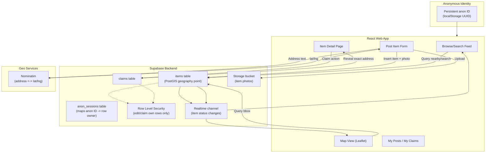

# GiveShare: Community Giveaway & Pickup Locator
## Technical Architecture & Implementation Plan

---

## 1. Executive Summary & Scope

### 1.1 Objective
Build a responsive web app where people can post either an item they want to **give away** or an item/need they're **requesting**, each with a pickup/drop-off location. Others can browse, search, and claim/fulfill those posts. A map view shows where everything is, and urgent or critical needs surface prominently across the whole app so they don't get buried.

### 1.2 Core Specifications (Agreed Decisions)
* **Platform:** Responsive web app (desktop + mobile browser), no native app for v1.
* **Post types:** Every post is either an **offer** (giving something away) or a **request** (asking for something needed). Requests carry a self-declared urgency: `normal`, `urgent`, or `critical`.
* **Urgent needs banner:** A sticky site-wide banner (below the navbar, on every page) surfaces all `urgent`/`critical` requests, most severe first, and disappears once nothing qualifies.
* **Map/Geocoding:** **OpenStreetMap + Leaflet** for the map UI, **Nominatim** for address ↔ coordinate geocoding. No API keys required. Map pins are color-coded: green (offer), blue (normal request), orange (urgent request), red (critical request).
* **Claim/Fulfill Flow:** **First-come, first-served instant claim**, enforced by a DB unique constraint. For an offer this means "claiming" the item; for a request it means "offering to fulfill" it. No poster approval step either way.
* **Auth:** **Anonymous-first.** No login required to post or claim at launch; each browser gets a persistent anonymous identity so people can see "my posts" / "my claims." Real sign-in (email/OAuth) is a planned Phase 2 addition that links to the existing anonymous identity.
* **Backend (current implementation):** Local **Express + SQLite** server (see `server/`) — a real persistent database requiring no external account, chosen over Supabase for zero-setup local development. Swappable for a hosted Postgres/Supabase backend later without changing the frontend API contract.
* **Photo intelligence:** Optional **Google Cloud Vision API** integration (`server/vision.js`) suggests a title/category/description from an uploaded photo's labels, and blocks photos flagged by SafeSearch (adult/violence/racy) both in the live preview and again server-side on submission. Fails open (posting still works normally) when no API key is configured.
* **Location Privacy:** Public map/listing shows an **approximate pin** (jittered/rounded location or general area). The **exact address is revealed only after a claim/fulfillment is made**, to that person only.

---

## 2. High-Level Architecture



---

## 3. Data Model (Supabase / Postgres + PostGIS)

```sql
-- Anonymous identity, upgraded to real auth later
create table anon_sessions (
  id uuid primary key default gen_random_uuid(),
  display_name text,              -- optional, user-chosen nickname
  linked_auth_user_id uuid,       -- null until Phase 2 sign-in links this session
  created_at timestamptz default now()
);

create table items (
  id uuid primary key default gen_random_uuid(),
  owner_session_id uuid references anon_sessions(id) not null,
  title text not null,
  description text,
  category text,                  -- e.g. furniture, clothing, electronics, books, other
  photo_url text,
  status text not null default 'available', -- available | claimed | picked_up | removed
  approx_location geography(Point, 4326) not null,   -- public, jittered/rounded
  exact_location geography(Point, 4326) not null,    -- private until claimed
  exact_address text not null,                        -- private until claimed
  created_at timestamptz default now(),
  expires_at timestamptz          -- optional auto-expire for stale posts
);
create index items_approx_location_idx on items using gist (approx_location);

create table claims (
  id uuid primary key default gen_random_uuid(),
  item_id uuid references items(id) not null,
  claimant_session_id uuid references anon_sessions(id) not null,
  claimed_at timestamptz default now(),
  unique (item_id) -- enforces first-come-first-served: one active claim per item
);
```

* **Row Level Security:** an `items` row can only be updated/deleted by the `anon_sessions` row matching the caller's session ID (passed via a custom header/JWT claim); `exact_address`/`exact_location` columns are only selectable by the owner or the claimant (via a Postgres view or RLS policy), everyone else sees `approx_location` only.
* **Jittering approach:** `approx_location` is computed at insert time by randomly offsetting `exact_location` by ~100–300m (or snapping to a coarse grid), so the public map never pinpoints a home address.

---

## 4. Key User Flows

### 4.1 Post an Item
1. Form opens with a photo upload prompt first ("Add a photo" with a "Skip for now" option), then title, description, category, and pickup address.
2. Address is geocoded via Nominatim → `exact_location`; `approx_location` derived by jitter.
3. `expires_at` set to 30 days out; item inserted tied to the browser's anon session ID; item appears in feed and map immediately (Realtime), using a placeholder image if no photo was added.

### 4.2 Browse & Search
* List/grid view with filters: category, distance from a location, keyword search.
* Map view (Leaflet) plots `approx_location` pins; clicking a pin opens a popup summary → item detail page.
* "Search this area" control re-queries items within the current map bounds (PostGIS `ST_DWithin` / bbox query).

### 4.3 Claim an Item
1. From the item detail page, user clicks "Claim."
2. Backend inserts a row into `claims` — the `unique(item_id)` constraint guarantees only the first request wins if two people click simultaneously; item status flips to `claimed`.
3. On success, the exact address and a map pin at the real location are revealed to the claimant only.
4. Item is removed from public "available" feed/map (or shown greyed-out as claimed).

### 4.4 Post-Pickup
* Claimant or poster marks the item "Picked up," which archives it (soft-delete / status change) so it drops out of all views.
* Optional: auto-expire unclaimed items after N days (`expires_at`) to keep the map from filling with stale posts.

### 4.5 My Posts / My Claims
* Since there's no login yet, this page reads the anon session ID from `localStorage` and queries items/claims owned by that session — works only on the same browser/device until Phase 2 sign-in lets a user link/recover their session.

---

## 5. Map Feature Details

* **Library:** Leaflet with OpenStreetMap tile layer (free, no key).
* **Geocoding:** Nominatim for address search/autocomplete on the post form and for "search near an address." Client-side debouncing and result caching to respect Nominatim's usage policy (max ~1 req/sec, no heavy autocomplete-per-keystroke).
* **Clustering:** Use `leaflet.markercluster` once pin density is high, so the map stays readable in dense areas.
* **Pin styling:** Different marker style/color by category; a distinct style for "just posted" (e.g. last 24h) to surface fresh listings.

---

## 6. Project File Structure (React + Supabase)

```text
ai-social-good-hackathon-team-3/
├── package.json
├── vite.config.ts
├── .env.local                     # SUPABASE_URL, SUPABASE_ANON_KEY
├── supabase/
│   └── migrations/                # SQL migrations for items, claims, anon_sessions
├── src/
│   ├── lib/
│   │   ├── supabaseClient.ts
│   │   ├── anonSession.ts         # get/create persistent anon ID in localStorage
│   │   └── geocode.ts             # Nominatim request helpers + caching
│   ├── features/
│   │   ├── feed/                  # Browse/search list view
│   │   ├── map/                   # Leaflet map view + marker clustering
│   │   ├── post-item/             # Create-item form
│   │   ├── item-detail/           # Item page + claim action
│   │   └── my-stuff/              # My posts / my claims
│   ├── components/                # Shared UI (Button, Card, PhotoUpload, etc.)
│   └── App.tsx
└── README.md
```

---

## 7. Implementation Roadmap

### Milestone 1: Foundation
- [ ] Scaffold React + Vite app; set up Supabase project, tables, and RLS policies.
- [ ] Implement anon session creation (`localStorage` UUID) and pass it with every write.

### Milestone 2: Posting & Geocoding
- [ ] Build post-item form with photo upload to Supabase Storage.
- [ ] Integrate Nominatim geocoding; compute and store approximate + exact locations.

### Milestone 3: Browse, Search, Map
- [ ] Build feed with category/distance/keyword filters.
- [ ] Build Leaflet map view plotting approximate pins with clustering.
- [ ] Wire Realtime so new/claimed items update both views live.

### Milestone 4: Claiming
- [ ] Implement claim action with unique-constraint race handling.
- [ ] Reveal exact address/map pin to claimant only; update item status everywhere.
- [ ] Build "My Posts / My Claims" page from the local anon session.

### Milestone 5: Polish
- [ ] Mark-as-picked-up flow; optional item expiry job.
- [ ] Empty/error states, mobile layout pass, basic abuse safeguards (report button, rate-limit posting).

### Phase 2 (Post-hackathon)
- [ ] Real authentication (email/OAuth via Supabase Auth), linking to existing anon session so history carries over.
- [ ] Notifications (email/push) when an item is claimed or a saved search has new matches.
- [ ] Moderation tools / reporting queue.

---

## 8. Decisions (Resolved)

1. **Photo requirement** — optional. The post form should prompt/encourage adding a photo first (e.g. photo upload step shown before the text fields, with a "skip for now" option), but an item can be posted without one — falls back to a placeholder image in the feed/map popup.
2. **Item categories** — fixed taxonomy for MVP: `furniture`, `clothing`, `electronics`, `books`, `household`, `toys`, `other`. Simpler filters/pins-by-category than free-tagging; can add free tags later.
3. **Abuse/safety** — lightweight "Report" button on each item for MVP (flags the item; after a small threshold of reports it's auto-hidden pending review). No moderation dashboard yet — reviewing flagged items can be a manual DB query for the hackathon demo.
4. **Item lifetime** — items auto-expire 30 days after posting (`expires_at` set at insert time) and drop out of the feed/map automatically. Poster can "renew" from My Posts to push the expiry out, since there's no email/notifications yet to prompt them.
5. **Anonymous session recovery** — accepted limitation for v1: losing browser storage loses access to "My Posts/Claims," but **all items themselves live in the shared Supabase DB, not the browser** — every browser/session sees the full, current set of posted items on load/refresh, regardless of who posted them. Only the *ownership convenience view* (which items are "mine") is tied to the local anon ID until Phase 2 real auth links a recoverable account.
